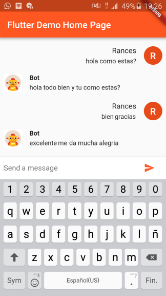

# Dialogflow v1 & v2 for Flutter apps.


 

### :heart: Star :heart: the repo to support the project. Thanks!

A new Flutter package.
* [Example](https://github.com/VictorRancesCode/flutter_dialogflow/tree/master/example)


<p align="center">
  
</p>

## Awesome Tutorials
* [Flutter and Bots (DialogFlow)](https://medium.com/flutterpub/flutter-and-bots-dialogflow-d490fc7e5aaf). By [Aseem Wangoo](https://medium.com/@aseemwangoo)
* [Chatbot Inventory Tracking iOS & Android App with Flutter, DialogFlow, and GCP](https://medium.com/flutter-community/chatbot-inventory-tracking-ios-android-app-with-flutter-dialogflow-and-gcp-d7d903ce7f90). By [Alfian Losari](https://medium.com/@alfianlosari)

Thanks for the tutorials!
## Installation

* Add this to your package's pubspec.yaml file:
```
dependencies:
  flutter_dialogflow: ^0.1.0
```
* You can install packages from the command line:
  with Flutter:
```
$ flutter packages get
```

* Dialogflow v1  Import it Now in your Dart code, you can use:
```
 import 'package:flutter_dialogflow/flutter_dialogflow.dart';
```
* Or Dialogflow v2  Import it Now in your Dart code, you can use:
```
 import 'package:flutter_dialogflow/dialogflow_v2.dart';
```

## Usage
### Dialogflow v1
* [Dialogflow](https://dialogflow.com/) register and create new Agent
* Copy Api key (Token)
* Code
```
  Dialogflow dialogflow = Dialogflow(token: "Your Token");
  AIResponse response = await dialogflow.sendQuery("Your Query");
```
* Example
```
  void Response(query) async {
    Dialogflow dialogflow = Dialogflow(token: "10178f9cb6cf12321asdf4aae75c87cd");
    AIResponse response = await dialogflow.sendQuery(query);
    print(response.getMessageResponse());
  }
```


### Dialogflow v2
* Dialogflow](https://dialogflow.com/) register and create new Agent
* Project Setup and Authentication
    * First of all, we need to create a Google Cloud Platform Project using [Console Google Cloud](https://console.cloud.google.com/)
    * Create or select an existing GCP project.
    * From the GCP console, go to APIs and Services and click on credentials. 
    * Click on Create credentials and choose Service account key.
    * Select your service account from the dropdown, choose JSON and click Create. This will download the JSON key to your computer. Save it securely.
    * We downloaded a JSON file with all our data.
* In your project create folder assets(folder name recommended optional)
* Move file json in your project in folder created
* open file pubspec.yaml
```
flutter:
  uses-material-design: true
  assets:
    - assets/your_file_downloaded_google_cloud.json
```
* Import dialogflow_v2
```
import 'package:flutter_dialogflow/dialogflow_v2.dart';
```

* Code
```
  AuthGoogle authGoogle = await AuthGoogle(fileJson: "Asset Your File Json").build();
  // Select Language.ENGLISH or Language.SPANISH or others...
  Dialogflow dialogflow =Dialogflow(authGoogle: authGoogle,language: Language.ENGLISH); 
  AIResponse response = await dialogflow.detectIntent("Your Query");
```

* Example
```
  AuthGoogle authGoogle = await AuthGoogle(fileJson: "assets/your_file_downloaded_google_cloud.json").build();
  Dialogflow dialogflow = Dialogflow(authGoogle: authGoogle,language: Language.ENGLISH);
  AIResponse response = await dialogflow.detectIntent("Hi!!!");
  print(response.getMessage())
```

* Or Get List Message type Card 
```
Call function response.getListMessage() 
response List<dynamic>
example 
new CardDialogflow(response.getListMessage()[0]).title
Convert first item in CardDialogflow for worked easy
CardDialogflow have
- title
- subtitle
- imageUri
- List buttonss
    - each button have text and postback
```

 

### Dialogflow For Flutter Web
Visit the repository: [Flutter Dialogflow Web](https://github.com/VictorRancesCode/flutter_dialogflow_web) 🚀